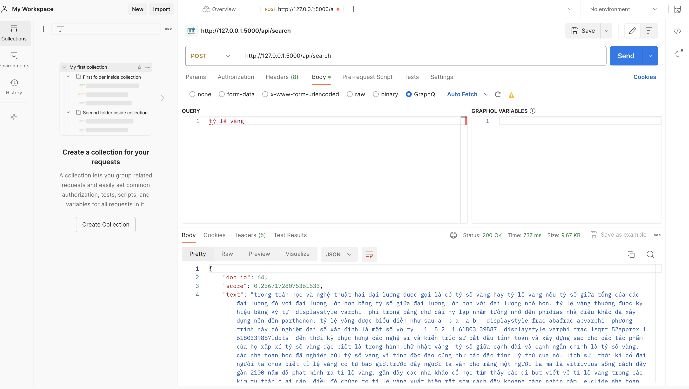
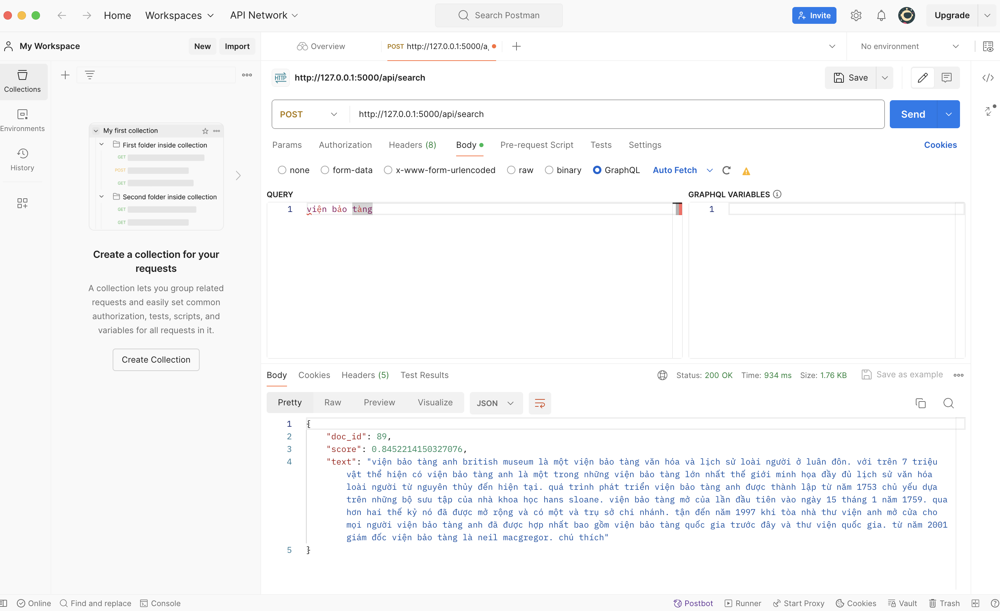
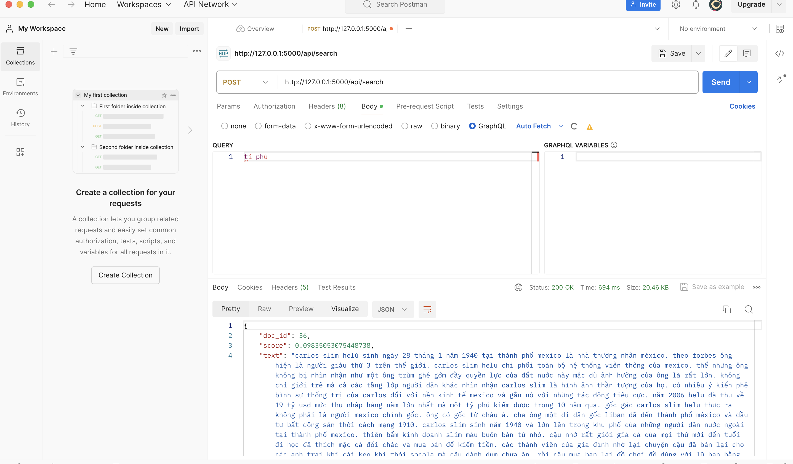

### Installation

```
pip install -r requirements.txt
```

### Run server

```
python serve.py
```

### Test API

```
curl -X POST http://127.0.0.1:5000/api/search -H "Content-Type: application/json" -d '{"query": "Việt Nam vững mạnh"}'

```

### Demo
#### Search `tỷ lệ vàng`



#### Search `viện bảo tàng`



#### Search `tỉ phú`

