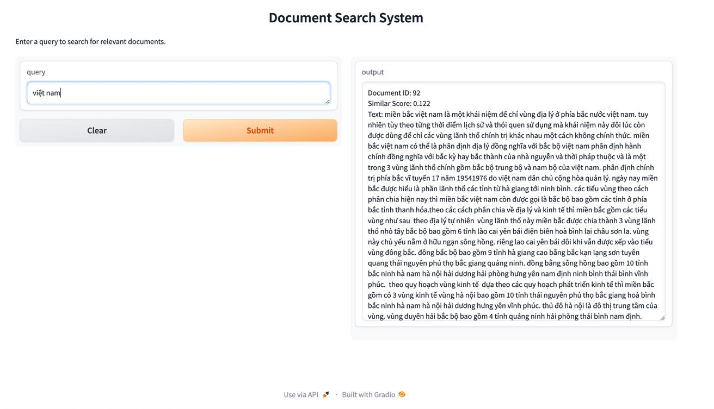

### Installation

```
pip install -r requirements.txt
```

### Run server

```
bash run_service.sh
```

### Test API (if necessary) 

```
curl -X POST http://127.0.0.1:5000/api/search -H "Content-Type: application/json" -d '{"query": "Việt Nam vững mạnh"}'

```

### Demo
#### Search the keyword in the interface



